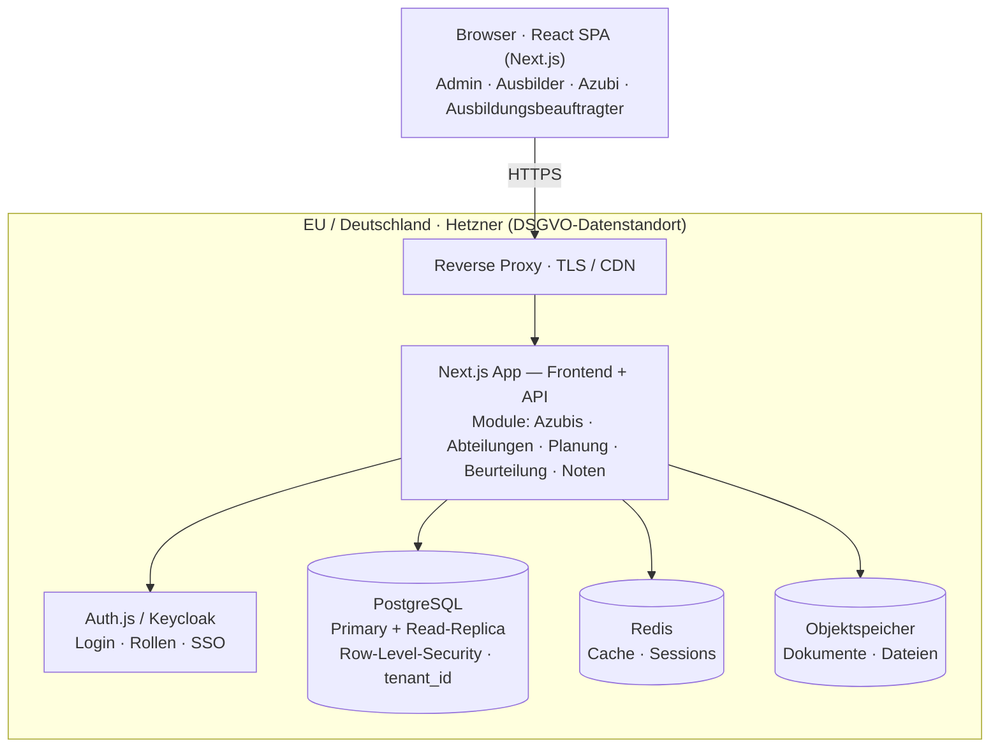
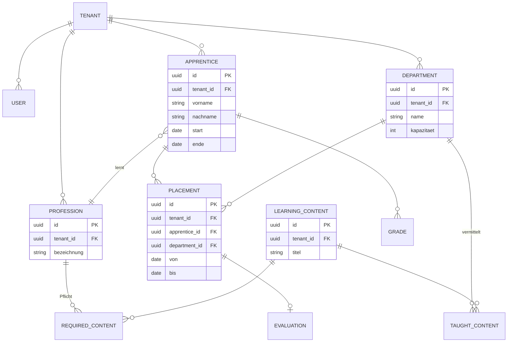

# AzubiPlan — Architektur

> Verwaltungssoftware für Auszubildende (mandantenfähige B2B-SaaS).
> Stand: 2026-06-19 · Status: **MVP in Arbeit** — Gerüst + erste Features stehen.

Dieses Dokument hält die Architektur- und Technologie-Entscheidungen fest (das „Warum").
Lokales Setup & Onboarding: **[README.md](README.md)** · aktueller Umsetzungsstand:
**[CLAUDE.md](CLAUDE.md)** und Abschnitt 10.

---

## 1. Was wir bauen

AzubiPlan ist eine mandantenfähige SaaS, mit der Unternehmen ihre Auszubildenden
verwalten und **verplanen**. Herzstück ist die Einsatzplanung: Azubis rotieren durch
Abteilungen, und der Ausbilder muss sicherstellen, dass alle Pflicht-Lerninhalte
(Ausbildungsrahmenplan) vermittelt werden.

### Rollen
| Rolle | Aufgabe |
|---|---|
| **Admin** | Verwaltet den Mandanten (Firma), Nutzer und Stammdaten |
| **Ausbilder** | Plant Azubis, behält Überblick über Abdeckung & Konflikte |
| **Azubi** | Sieht seinen Plan, trägt Noten ein |
| **Ausbildungsbeauftragter** | Ansprechpartner einer Abteilung, beurteilt Azubis |

### Kernfunktionen
- Azubis mit Stammdaten anlegen
- Abteilungen anlegen (inkl. Kapazität & vermittelter Lerninhalte)
- Azubis auf Abteilungen verplanen (Rotation über Zeiträume, Dauer einstellbar)
- **Abdeckungs-Check / Lückenanzeige:** werden alle Pflicht-Lerninhalte abgedeckt?
- Beurteilung der Azubis durch Abteilungen nach Einsatz
- Noteneingabe durch Azubis

### Zielgröße
~2.000 Azubis + 500 Verwaltungsaccounts; skalierbar von 10 bis Großkonzern.

> **Wichtig:** Das ist für PostgreSQL eine *kleine* Datenmenge. Kein Grund für
> Microservices, Kubernetes oder Sharding. Trägheit entsteht nicht durch die Menge,
> sondern durch fehlende Indizes, N+1-Abfragen und fehlende Pagination.

---

## 2. Leitprinzipien

1. **Modularer Monolith** statt Microservices — eine deploybare App, intern sauber in Module geschnitten.
2. **Nicht über-engineeren.** Vertikal skalieren + Read-Replica, *wenn* nötig — nicht vorher.
3. **Schnell = Disziplin, nicht Hardware:** Indizes, Pagination, kein N+1, Caching.
4. **Datenschutz & Mandantentrennung von Tag 1** — nicht nachrüsten.
5. **MVP-first**, validiert mit einem echten Pilotkunden.

---

## 3. Tech-Stack

| Schicht | Wahl | Rolle |
|---|---|---|
| Frontend + API | **Next.js** (TypeScript) | Oberfläche und API in einem Projekt |
| ORM / DB-Anbindung | **Prisma** | Typsicherer Zugriff + Migrationen |
| Datenbank | **PostgreSQL** | Relationale Daten, RLS für Mandanten |
| UI-Komponenten | **shadcn/ui** | Fertige Tabellen, Formulare etc. |
| Auth | **Auth.js** (Keycloak später für Enterprise-SSO) | Login + Rollen |
| Cache | Redis (erst bei Bedarf) | Sessions, teure Abfragen |
| Hosting | **Hetzner** (DE), Docker | DSGVO-Datenstandort, kein Lock-in |

### Offene Entscheidungen
- **Prisma vs. Drizzle** → Prisma (einsteigerfreundlicher, top Doku).
- **Backend in Next.js vs. separates NestJS** → erstmal in Next.js (Server Actions /
  Route Handlers); auslagern nur, wenn die Planungslogik wirklich komplex wird.

---

## 4. Architektur-Überblick

---

## 5. Mandantenfähigkeit (Multi-Tenancy)

- **Modell:** Geteilte DB + `tenant_id`-Spalte + PostgreSQL **Row-Level-Security (RLS)**.
- RLS erzwingt die Trennung auf **Datenbank-Ebene** (nicht nur im Code) → „default-deny".
- Jede Tabelle mit personenbezogenen Daten trägt `tenant_id`.
- **Ein Isolations-Bug = DSGVO-Datenleck.** Von Anfang an mit Tests pro Rolle/Mandant absichern.
- Eigene DB pro Mandant nur als optionaler **Enterprise-Tarif** für Großkunden.

---

## 6. Kern-Datenmodell (Skizze)

**Abdeckungs-Logik (das Killer-Feature):** Alle `LEARNING_CONTENT`, die über die Einsätze
(`PLACEMENT`) eines Azubis in den jeweiligen Abteilungen (`TAUGHT_CONTENT`) vermittelt
werden, werden gegen die Pflicht-Inhalte seines Berufs (`REQUIRED_CONTENT`) abgeglichen.
Was fehlt, ist die **Lücke**, die der Ausbilder schließen muss.

> Hinweis: `REQUIRED_CONTENT` und `TAUGHT_CONTENT` sind Verknüpfungstabellen
> (Beruf ↔ Lerninhalt bzw. Abteilung ↔ Lerninhalt).

> **Umgesetzt:** Dieses Modell ist als `prisma/schema.prisma` implementiert (die
> verbindliche Single Source of Truth). Ergänzungen seither: `passwordHash` am `USER`
> (Login) und `DEPARTMENT_PROFESSION` als **Eignung** — welche Abteilung für welchen
> Beruf als Einsatzort infrage kommt (steuert den Planer).

---

## 7. Datenschutz / DSGVO (von Tag 1)

Wir sind rechtlich **Auftragsverarbeiter** für unsere Kunden.

- **Minderjährige** — viele Azubis sind 16–18 → besonderer Schutz (Art. 8 DSGVO).
- **⚠️ Betriebsrat / Mitbestimmung (§87 BetrVG)** — ein System, das Mitarbeiter *plant
  und beurteilt*, kann eine „technische Einrichtung zur Überwachung" sein → beim Kunden
  oft **Betriebsvereinbarung** nötig. Transparenz & Zweckbindung aktiv einbauen.
- **AV-Vertrag (AVV)** mit jedem Kunden — und AVVs mit unseren Subdienstleistern.
- **Betroffenenrechte** — Auskunft/Export + Löschung als echte Funktionen von Anfang an.
- **Löschkonzept** — automatische Anonymisierung/Löschung nach Frist (Ausbildungsende).
- **Audit-Log** — wer hat welche personenbezogenen Daten gesehen/geändert.
- **TOMs** — Verschlüsselung at-rest + in-transit, Zugriffskontrolle, Backups.

---

## 8. Stolpersteine

1. **Über-Engineering** für Skalierung, die nie kommt — der teuerste Fehler.
2. **Mandanten-Isolation** — ein Leck = DSGVO-GAU. RLS + harte Tests.
3. **Betriebsrat/§87 BetrVG** — Beurteilung triggert Mitbestimmung.
4. **Berechtigungen feiner als „4 Rollen"** — Rolle × Mandant × Abteilung × Beziehung.
5. **Rahmenplan-Daten beschaffen** — als Vorlagen je Beruf seeden, vom Kunden anpassbar.
6. **Daten-Import/Onboarding** — Massen-Import (Excel) ist Pflicht für Akzeptanz.
7. **Performance-Fallen** — N+1, fehlende Indizes, ungepaginierte Listen.
8. **Backups & Restore** — automatisiert *und* Wiederherstellung testen (PITR).
9. **Audit-Log + Soft-Delete von Tag 1** — später nachrüsten ist teuer.
10. **MVP-Disziplin** — erst die Kernschleife, validiert mit einem Pilotkunden.

---

## 9. Roadmap in Phasen

- **Phase 0** — 1 Pilotkunden gewinnen, Datenmodell + AVV/DSGVO-Grundlagen festklopfen.
- **Phase 1 (MVP)** — Auth+RBAC, Mandanten, Azubi-/Abteilungs-Verwaltung, manuelle
  Einsatzplanung mit Lückenanzeige, einfache Beurteilungen + Noten. EU-Hosting, Backups,
  Audit-Log, Export/Löschen.
- **Phase 2** — Benachrichtigungen, Massen-Import, Auswertungen/Dashboards, SSO.
- **Phase 3** — automatische Planungsvorschläge (Constraint-Solver), Analytik, Mobil.

---

## 10. Umsetzungsstand & nächste Schritte

Das Prisma-Schema (Abschnitt 6) ist umgesetzt und migriert. Es laufen: **Login mit
Rollen**, App-Shell mit rollenabhängiger Navigation, **Azubi-Verwaltung** und der
visuelle **Einsatzplaner** (Drag & Drop, Ansichten Monat/Woche/Tag, Abteilungs-Eignung
je Beruf). Stand im Detail: **[README.md](README.md)** / **[CLAUDE.md](CLAUDE.md)**.

Nächste Bausteine:
1. **Row-Level-Security** in PostgreSQL — DB-tiefe Mandantentrennung *unter* der App-Schicht.
2. **Abdeckungs-Check** — Lückenanzeige der Pflicht-Lerninhalte (das Killer-Feature).
3. **Beurteilungen & Noten**, danach Stammdaten-Pflege (Abteilungen/Berufe/Lerninhalte) per UI.
